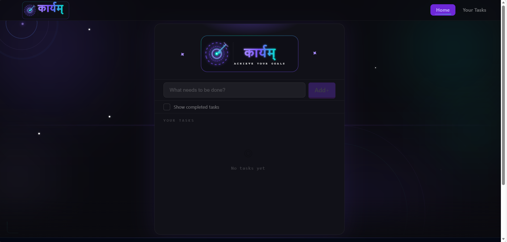
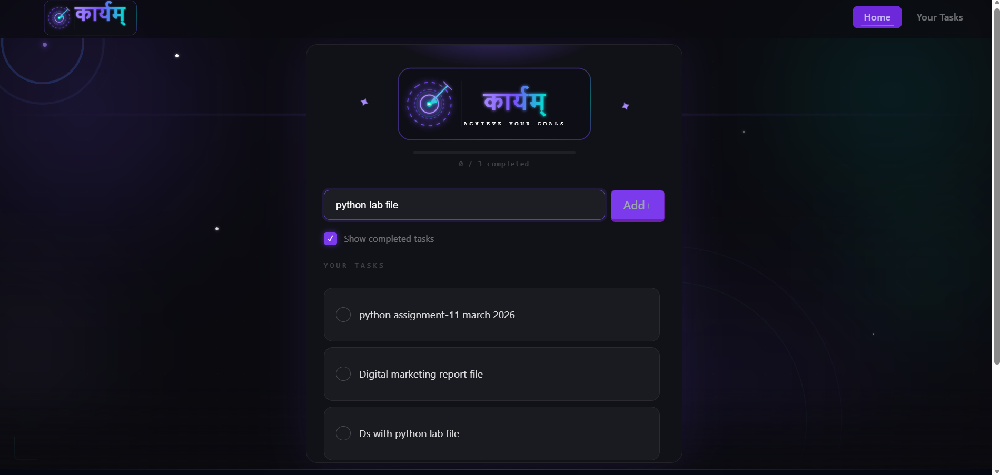
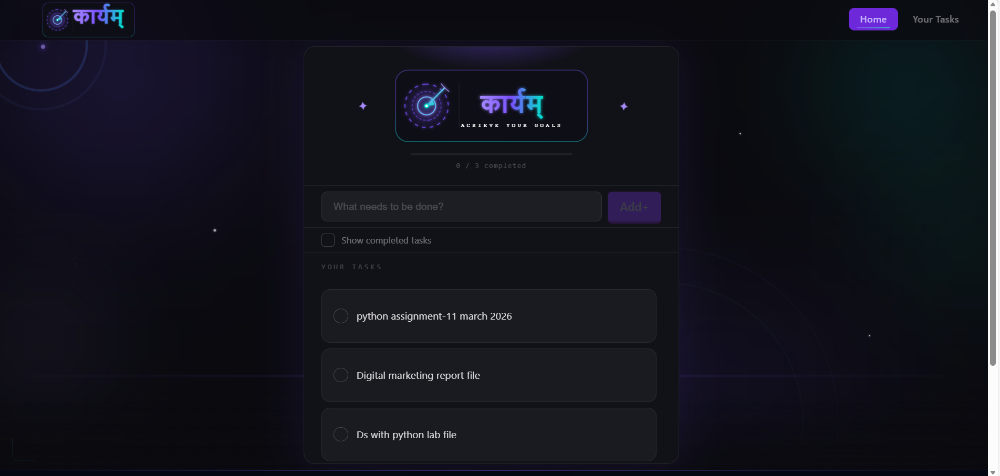

# 🚀 Karyam – To-Do List Web Application

  
  
  
  
  
  

---

## 🌐 Live Demo

🔗 **Production URL:**  
👉 https://mantram-mongo-db.vercel.app/

---

---
## 📧 Connect with me for collaboration

     

---

---
## 📖 About The Project

**Karyam** is a modern, responsive To-Do List Web Application built using React and Vite.  

It allows users to:
- Add tasks
- Edit tasks
- Mark tasks as completed
- Delete tasks
- Persist tasks using LocalStorage

The project focuses on clean UI, smooth animations, and intuitive task management.

---
---

## ✨ Core Features

- ✅ Add New Tasks
- ✏️ Edit Existing Tasks
- ❌ Delete Tasks
- ✔️ Mark Tasks as Completed
- 🔄 Toggle Show/Hide Completed Tasks
- 📊 Progress Bar (Completion Tracking)
- 💾 LocalStorage Data Persistence
- 🌙 Modern Dark UI Design
- ⚡ Fast Performance with Vite
---
---

## 🛠 Tech Stack

### 🎨 Frontend
- ⚛️ React.js
- ⚡ Vite
- 🎨 Tailwind CSS
- 🎯 React Icons
- 🆔 UUID

### 💾 Data Handling
- Browser LocalStorage API
---
---

## 🖼 Screenshots

> 📌 Add your screenshots inside a `/screenshots` folder

### 🏠 Home Page

### ➕ Add Task

### 📋 Task List

---

# 📂 Project Structure

---
Karyam-Todo-App/
│
├── src/
│   ├── components/
│   │   ├── Navbar.jsx
│   │   ├── Footer.jsx
│   │   ├── AnimatedBackground.jsx
│   │   └── LakshyamTitleLogo.jsx
│   │
│   ├── App.jsx
│   ├── main.jsx
│   └── index.css
│
├── public/
├── package.json
└── README.md

---
---

# ⚙️ Installation Guide

# 1️⃣ Clone Repository
git clone https://github.com/your-username/karyam-todo-app.git
cd karyam-todo-app

---

---

# 2️⃣ Install Dependencies
npm install

---

---

 # 3️⃣ Run Development Server
npm run dev

---

---
 # App runs at:

http://localhost:5173

---
---
# 🧠 Example Usage

# ➕ Adding a Task

Type task name in input field.

Press Enter or click Add.

Task appears in list.

---
---

# ✔️ Mark Task Completed

Click checkbox beside task.

Progress bar updates automatically.

---

---
# ✏️ Edit Task

Click edit icon.

Modify task.

Re-add updated task.

---
---

# ❌ Delete Task

Click delete icon.

Task is permanently removed.

---
---

# 🔮 Future Enhancements

🔐 User Authentication

☁️ Cloud Database Integration

📱 PWA Support

🌓 Light/Dark Mode Toggle

📊 Analytics Dashboard

🧪 Unit Testing (Jest + React Testing Library)

---
---

# 👨‍💻 Author
Priyanshu Kumar

⭐ If you like this project, consider giving it a star!

---
---

# 📜 License

This project is licensed under the MIT License.

---